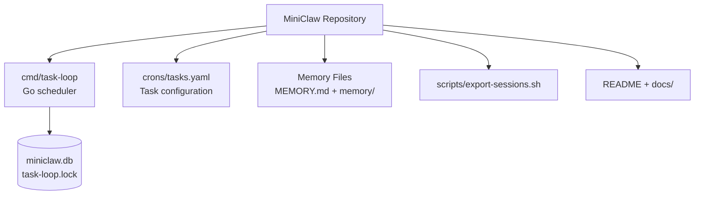
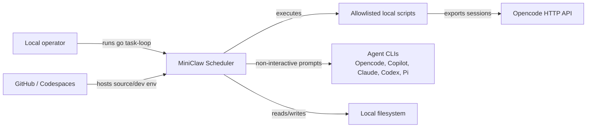
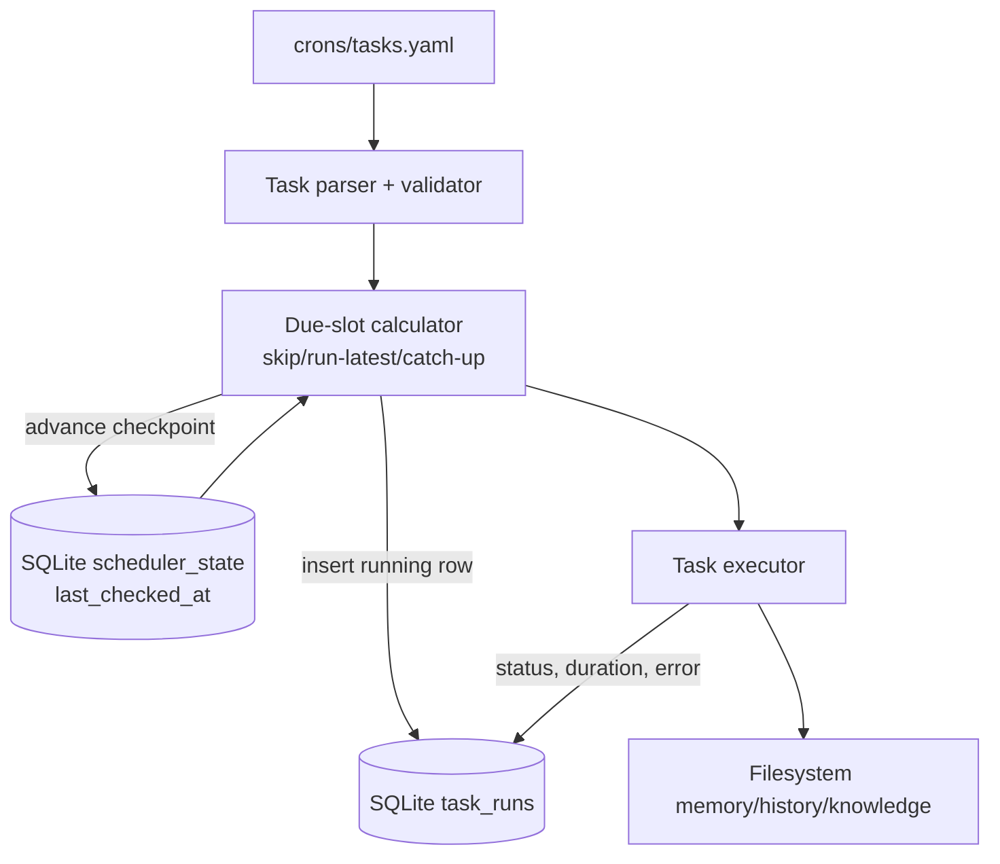
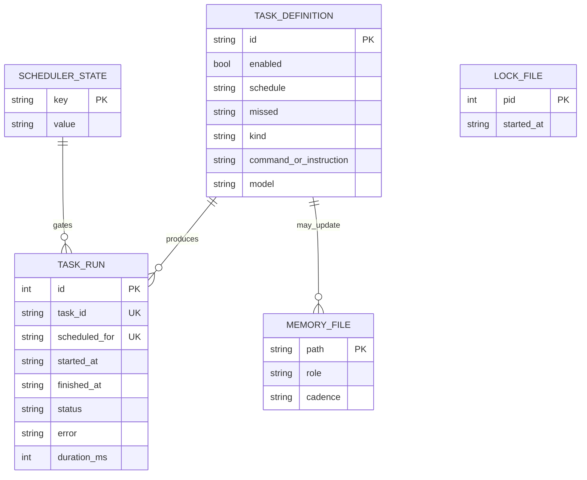

# AgentSheduler / MiniClaw Codebase Report

MiniClaw is a Markdown-configured Go scheduler for local automation and CLI-agent workflows. It reads cron-like task definitions, executes allowlisted scripts or supported agent CLIs, records run history in SQLite, and maintains file-based assistant memory artifacts.

The project is written primarily in Go 1.25 with YAML configuration, SQLite via `modernc.org/sqlite`, shell scripting with `curl`/`jq`, Markdown documentation and memory files, and local CLI integrations for Opencode, GitHub Copilot CLI, Claude, Codex, and Pi. It is designed for local operation, Codespaces-friendly development, and filesystem-backed persistence rather than a hosted service.

## High-level package diagram

[Mermaid source](diagrams/agentscheduler-package.mmd)



## High-level external interaction diagram

[Mermaid source](diagrams/agentscheduler-external-interactions.mmd)



## High-level internal data-flow diagram

[Mermaid source](diagrams/agentscheduler-internal-data-flow.mmd)



## High-level data-model diagram

[Mermaid source](diagrams/agentscheduler-data-model.mmd)



## Snapshot analyzed

- Repository: [`vii33/AgentSheduler`](https://github.com/vii33/AgentSheduler)
- HEAD analyzed: `f81d7f7a50df758cbdb19b5ec1f3f59e9ef903a5`
- Commit date: 2026-06-03
- Observed module path: `github.com/vii33/miniclaw`
- Product name in the codebase: `MiniClaw`

The repository name is misspelled as `AgentSheduler`; the code and README consistently describe the product as MiniClaw. Keeping those names straight matters because external URLs use the misspelling while Go/module/docs content uses MiniClaw.

## What the system does

MiniClaw is a local scheduler for automating assistant maintenance and agent-driven chores. Its core loop reads `crons/tasks.yaml`, validates enabled tasks, calculates due schedule slots, starts a run row in `miniclaw.db`, executes the configured action, records success or failure, and updates scheduler checkpoint state.

Supported task modes are deliberately split:

- `shell` for allowlisted local commands such as `./scripts/export-sessions.sh`.
- `opencode` for `opencode run` instructions with default/fallback model handling.
- `copilot-cli`, `claude`, `codex`, and `pi-agent` for direct non-interactive CLI execution.

That split is a good design choice. Treating agent invocations as structured binary calls instead of arbitrary shell strings is safer and easier to reason about.

## Repository layout

```text
AgentSheduler/
├── AGENTS.md
├── MEMORY.md
├── README.md
├── cmd/
│   └── task-loop/
│       ├── main.go
│       ├── main_test.go
│       └── integration_test.go
├── crons/
│   └── tasks.yaml
├── docs/
│   ├── memory-workflow.md
│   └── task-scheduler-architecture.md
├── go.mod
├── go.sum
├── memory/
│   ├── facts.md
│   ├── history/
│   └── knowledge/
└── scripts/
    └── export-sessions.sh
```

## Core runtime path

1. `findRepoPaths` discovers the repository root and the key files: `crons/tasks.yaml`, `miniclaw.db`, and `task-loop.lock`.
2. `openDB` opens SQLite, enables WAL and a busy timeout, and applies migrations.
3. `readTasks` unmarshals YAML, validates all tasks, applies default missed-run behavior, and filters disabled tasks.
4. `readLastChecked` loads the previous scheduler checkpoint.
5. `findDueRuns` evaluates each task schedule between the prior checkpoint and the current time.
6. `insertRunningRun` creates a unique `(task_id, scheduled_for)` row so repeated scheduler passes do not duplicate work.
7. `executeTask` dispatches to shell, Opencode, or another supported CLI adapter.
8. `finishRun` writes terminal status, duration, and sanitized error text.
9. `writeLastChecked` advances the checkpoint.

## Task configuration model

Tasks are YAML records with:

| Field | Meaning |
|---|---|
| `id` | Unique stable task identifier. |
| `enabled` | Optional boolean; missing means enabled. |
| `schedule` | Five-field cron expression. |
| `missed` | `skip`, `run-latest`, or `catch-up`; missing means `run-latest`. |
| `kind` | `shell`, `opencode`, `copilot-cli`, `claude`, `codex`, or `pi-agent`. |
| `command` | Required for shell tasks. |
| `instruction` | Required for agent tasks. |
| `model` | Optional task-level model override for agent tasks. |

The checked-in tasks implement a memory workflow:

- `daily-export` runs `./scripts/export-sessions.sh` at 23:00 UTC.
- `daily-analysis` asks Opencode to summarize the current day into `MEMORY.md` and the history file at 23:15 UTC.
- `weekly-review` asks Opencode to summarize seven days into `memory/knowledge/weekly-YYYY-Www.md` every Monday at 09:00 UTC.

## Scheduling behavior

The scheduler uses minute-level cron matching. It supports three missed-run policies:

- `skip`: only run slots near the current polling window.
- `run-latest`: run just the latest missed slot when the machine was offline.
- `catch-up`: run every missed slot in chronological order.

This is practical for laptops and local development machines, where sleep/offline gaps are normal. The best default is `run-latest`; blindly catching up every missed agent prompt after a week offline would be expensive and annoying.

## Runtime storage

MiniClaw writes generated operational state outside the task YAML:

- `miniclaw.db` stores `task_runs` and `scheduler_state`.
- `task_runs` records task identity, scheduled slot, start/finish timestamps, terminal status, error text, duration, and a uniqueness constraint for duplicate prevention.
- `scheduler_state` currently stores `last_checked_at`.
- `task-loop.lock` prevents two continuous schedulers from running at the same time. Stale locks are removed if their recorded PID is no longer live.

The SQLite choice is sensible. JSON state files are tempting for tiny tools, but SQLite gives uniqueness, indexes, and queryable status without inventing a bad database badly.

## Execution and safety boundaries

Shell tasks are not full shell scripts embedded in YAML. They are split into argv-like words and must start with one of a small set of allowed prefixes:

- `./scripts/`
- `scripts/`
- `bash scripts/`
- `node scripts/`
- `go run ./cmd/`

Agent tasks use per-kind adapters with direct binary names and argument builders. Opencode has special handling: the scheduler prefers `zen/minimax2.5-free`, checks `opencode models`, and falls back to `opencode/minimax-m2.5-free` if available.

The project still trusts task authors a lot. The shell allowlist is useful but prefix-based allowlists are not a complete sandbox. That is acceptable for a local personal automation repo, but it would be a stupid foundation for a multi-user hosted scheduler without much stronger isolation.

## Memory workflow

The memory workflow is file-based:

- `MEMORY.md` holds distilled durable facts, decisions, lessons, and preferences.
- `memory/history/YYYY-MM-DD.md` holds raw daily session exports.
- `memory/knowledge/weekly-YYYY-Www.md` holds longer weekly or topical summaries.
- `memory/facts.md` is a lightweight scratchpad.

`scripts/export-sessions.sh` contacts an Opencode HTTP server, verifies health, fetches session/message data, and writes Markdown history. The scheduled analysis tasks then use agent prompts to turn raw history into durable memory.

## Tests and current quality signals

The repository has unit and integration tests around the scheduler. Test coverage focuses on the important operational risks: duplicate run prevention, failed task recording, missed-run policies, lock handling, task validation, placeholder expansion, and CLI adapter execution.

That is the right test surface. The project is a scheduler; bugs in due-slot math and duplicate execution matter far more than bikeshedding documentation formatting.

## How to run it

```bash
# Continuous loop; default poll interval is five minutes
go run ./cmd/task-loop

# One scheduler pass
go run ./cmd/task-loop --once

# Dry-run a specific instant
go run ./cmd/task-loop --once --dry-run --at 2026-03-07T23:15:00Z

# Run tests
go test ./...
```

## Important operational assumptions

- Local timezone handling should be treated carefully; persisted timestamps are formatted in UTC.
- Each supported agent CLI must be installed and authenticated separately.
- Opencode HTTP export requires its local server plus `curl` and `jq`.
- Generated `miniclaw.db` and `task-loop.lock` are machine-managed and should not be hand-edited.
- Secrets belong in `.env`, not Markdown memory files.

## Notable strengths

- Go scheduler is straightforward and inspectable.
- SQLite run history is much better than ad hoc JSON for scheduler correctness.
- Agent invocation is separated by adapters rather than shell-concatenated command strings.
- Missed-run policy is explicit per task.
- The lock file has stale-lock recovery.
- Memory workflow is simple enough for a human to audit.

## Risks and improvement opportunities

- The repository URL/name typo (`AgentSheduler`) is embarrassing and will keep leaking into links. Rename or document the alias clearly.
- The README badge points to `vii33/MiniClaw`, while the analyzed repository is `vii33/AgentSheduler`; that mismatch should be fixed.
- Prefix-based shell command allowlisting is a local convenience, not a security boundary.
- The scheduler has no web UI or notification layer; failures are only useful if someone queries or watches them.
- Agent task costs and side effects need operational guardrails if this grows beyond a personal tool.
